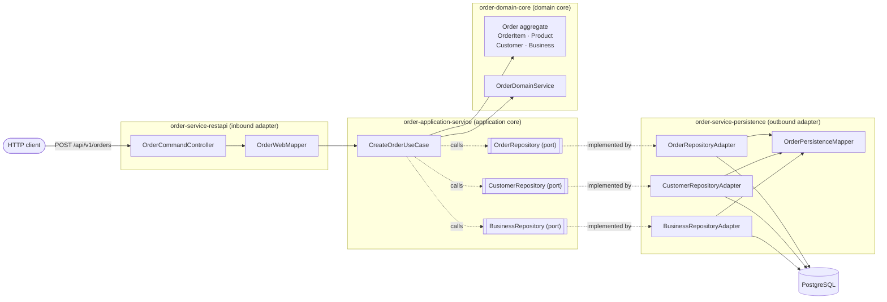

# Project Documentation

Documentation for **Spring_study** (`mptc.khay:Spring_study`) — a study project that builds an
order microservice with **DDD** and **hexagonal architecture (ports & adapters)** on
Spring Boot 4.1.1 / Java 25, laid out as a Maven multi-module build.

> These docs describe the code **as it exists today**, not an aspirational design.
> Where something is a stub or a known bug, it is called out as such rather than
> documented as if it worked. See [Current state & next steps](guides/current-state-and-next-steps.md).

## Start here

| If you want to… | Read |
| --- | --- |
| Understand the big idea and why the modules are split this way | [architecture/overview.md](architecture/overview.md) |
| Know what lives in each Maven module | [architecture/modules.md](architecture/modules.md) |
| Learn the domain: aggregates, entities, value objects, invariants | [architecture/domain-model.md](architecture/domain-model.md) |
| See how ports, adapters and the three DTO layers fit together | [architecture/ports-and-adapters.md](architecture/ports-and-adapters.md) |
| Trace one HTTP request end to end | [architecture/create-order-flow.md](architecture/create-order-flow.md) |
| Call the API | [api/orders-api.md](api/orders-api.md) |
| Run it on your machine | [guides/getting-started.md](guides/getting-started.md) |
| **Rebuild this project from an empty folder, step by step** | [guides/build-from-scratch.md](guides/build-from-scratch.md) |
| Follow the code style used here | [guides/conventions.md](guides/conventions.md) |
| Know what is unfinished and what to do next | [guides/current-state-and-next-steps.md](guides/current-state-and-next-steps.md) |
| Understand why a structural choice was made | [decisions/README.md](decisions/README.md) |

## Folder layout

| Folder | What goes here |
| --- | --- |
| [`architecture/`](architecture/) | Module map, hexagonal layering, domain model, flow diagrams |
| [`api/`](api/) | REST endpoint contracts, request/response payloads, error codes |
| [`decisions/`](decisions/) | Architecture Decision Records (ADRs), `NNNN-short-title.md` |
| [`guides/`](guides/) | How-tos: setup, build & run, the from-scratch walkthrough, conventions |

## The system in one picture

Every arrow that crosses into the core points **inwards**. The core never imports an adapter.

## Conventions for these docs

- One topic per file, kebab-case filenames (`create-order-flow.md`).
- Diagrams are Mermaid code blocks inside the Markdown, so they stay reviewable in a diff.
- ADRs are append-only: supersede an old decision with a new file rather than rewriting it.
- Update a doc in the same commit as the code change it describes.

See also [`../HELP.md`](../HELP.md) for upstream Spring Boot / Maven reference links.
