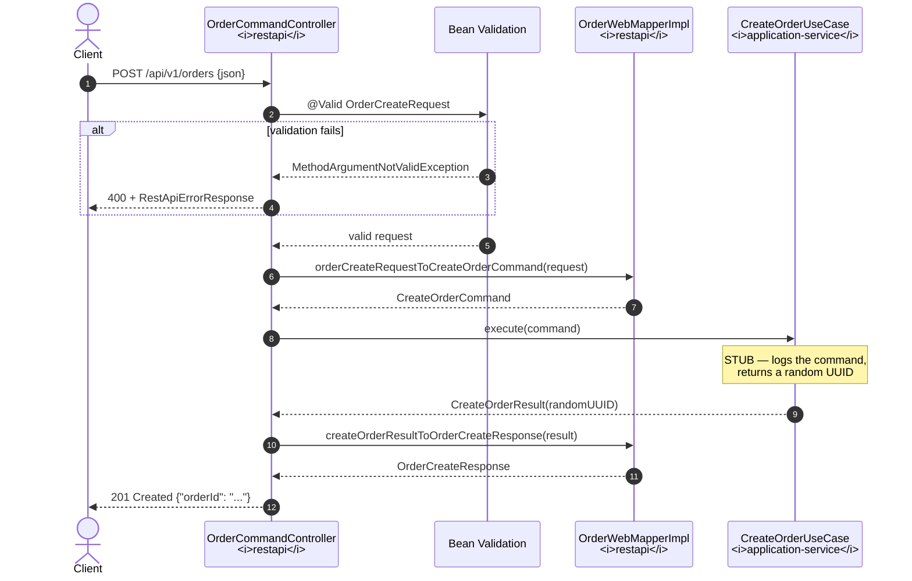
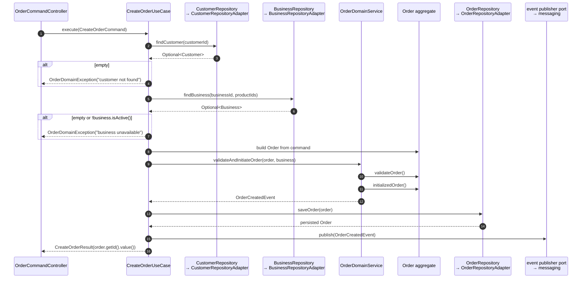

# Create Order — Request Flow

One `POST /api/v1/orders` traced through every layer. This documents **what the code does
today**, then what the finished flow is meant to look like.

## Today: the implemented path



Step by step:

**1–2. HTTP arrives.** Spring MVC binds the JSON body to `OrderCreateRequest` and, because of
`@Valid`, runs Jakarta Bean Validation over it.

**3. Validation failure.** `MethodArgumentNotValidException` is caught by
`GlobalExceptionHandler` (reached via the scannable `OrderGlobalExceptionHandler` subclass) and
turned into HTTP 400 with a `RestApiErrorResponse` whose `detail` lists every field error.
Nothing downstream is touched.

**5–6. Request → Command.** `OrderWebMapperImpl` (MapStruct-generated) copies `customerId`,
`businessId`, `price` and the item list into a `CreateOrderCommand`.

> ⚠️ Two fields silently do **not** survive this hop:
> `deliveryAddress` is `null` (the request calls it `orderAddress`) and every item's
> `subtotal` is `null` (the request calls it `subTotal`). Confirmed in the generated
> `OrderWebMapperImpl`, which assigns both as literal `null`.

**7–8. The use case.** Currently:

```java
@Component
@Slf4j
public class CreateOrderUseCase {
    public CreateOrderResult execute(CreateOrderCommand createOrderCommand) {
        log.info("executing CreateOrderUseCase: {}", createOrderCommand);
        return new CreateOrderResult(UUID.randomUUID());
    }
}
```

No repository is called, no `Order` is built, nothing is persisted. The endpoint answers 201
with a UUID that refers to nothing.

**9–11. Result → Response.** Mapped back to `OrderCreateResponse` and serialised. `@ResponseStatus(HttpStatus.CREATED)` sets 201.

## The intended full flow

This is the shape `CreateOrderUseCase` is being built towards — and the reason every port and
mapper already exists.



The division of labour is the thing to learn here:

| Responsibility | Lives in | Why |
| --- | --- | --- |
| HTTP shape, status codes, JSON | `OrderCommandController` | Changing the API must not touch business rules |
| Structural validation (`@NotNull`, `@Size`) | request DTOs | Cheap, at the edge, before anything is loaded |
| **Orchestration** — what to load, in what order, what to save, what to publish | `CreateOrderUseCase` | It is a *transaction script*: a sequence, not a rule |
| **Business rules** — is this price right, is this transition legal | `Order`, `OrderItem` | Rules belong with the data they constrain |
| **Cross-aggregate rules** — order vs. business catalogue | `OrderDomainService` | Fits on neither aggregate alone |
| SQL, entity mapping | `*RepositoryAdapter` + `OrderPersistenceMapper` | Swappable infrastructure |

Notice that the use case never contains an `if` about *business* correctness. It checks
existence, then delegates judgement to the domain. When you find yourself writing
`if (order.getPrice().compareTo(...) > 0)` inside a use case, that rule belongs on the
aggregate.

### Why the use case, not the controller, is transactional

`saveOrder` plus event publication must succeed or fail together. That makes
`CreateOrderUseCase.execute` the natural `@Transactional` boundary — one use case, one
transaction, one aggregate saved. (No `@Transactional` annotation is present yet; adding it is
on the [next-steps list](../guides/current-state-and-next-steps.md).)

## What a request looks like right now

```bash
curl -i -X POST http://localhost:8550/api/v1/orders \
  -H 'Content-Type: application/json' \
  -d '{
    "customerId": "7b0e0f5c-1c3f-4f2c-9a5b-6f4f8d2e1a10",
    "businessId": "3f2a9d61-8b47-4f2a-9c10-0d5a7e3b9c22",
    "orderAddress": { "street": "1 Main St", "postalCode": "10110", "city": "Bangkok" },
    "items": [
      { "productId": "c3d4e5f6-a7b8-4901-8234-56789abcdef0",
        "quantity": 2, "price": 25.00, "subTotal": 50.00 }
    ],
    "price": 50.00
  }'
```

```
HTTP/1.1 201 Created
{"orderId":"a1b2c3d4-...-random..."}
```

The full contract, including the error shape, is in [../api/orders-api.md](../api/orders-api.md).
