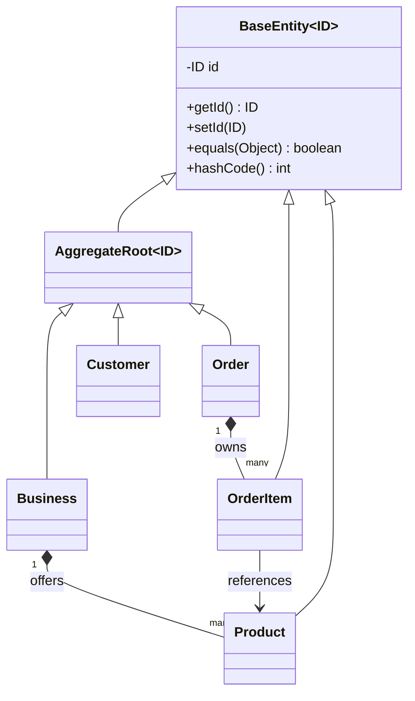
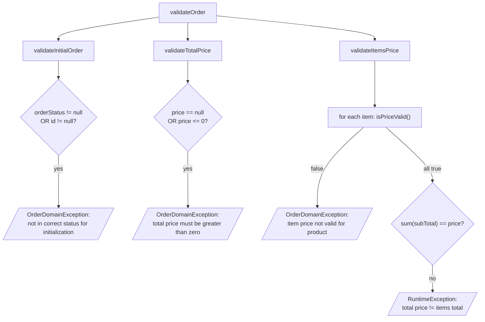
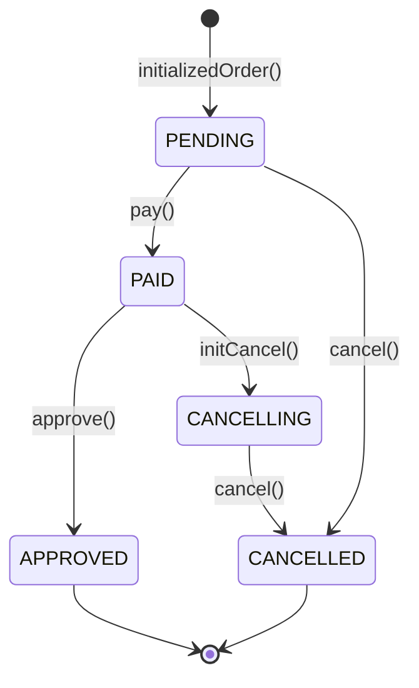

# Domain Model

Everything here lives in `order-domain-core` and `common-domain`, and compiles without Spring,
JPA or Jackson on the classpath.

## Building blocks



**Entity vs. value object.** `BaseEntity.equals` compares *only the id* — an `Order` whose
status changed is still the same order. Value objects are Java `record`s and use structural
equality — two `Money(BigDecimal("10.00"))` values are interchangeable, because a value object
has no identity, only a value.

**Aggregate root.** `AggregateRoot<ID>` adds nothing but meaning: it marks the *only* type a
repository may load or save. You never fetch an `OrderItem` directly; you fetch its `Order`
and go through it. That is why `OrderRepository` exposes `saveOrder(Order)` and not
`saveOrderItem(...)`.

## Value objects (`common-domain`)

| Type | Shape | Notes |
| --- | --- | --- |
| `OrderId`, `CustomerId`, `BusinessId`, `ProductId`, `TrackingId` | `record(UUID value)` | Typed ids. A method taking `OrderId` cannot be handed a `CustomerId` — a class of bug that raw `UUID` parameters allow |
| `OrderItemId` | `record(Integer value)` | Line numbers are local to one order, so a small int suffices |
| `StreetAddress` | `record(UUID id, String postalcode, String street, String city)` | |
| `OrderStatus` | enum | `PENDING`, `PAID`, `APPROVED`, `CANCELLING`, `CANCELLED` |
| `Money` | `record(BigDecimal amount)` | The only VO with behaviour |

### `Money`

```java
public static final Money ZERO = new Money(BigDecimal.ZERO);

public boolean isGreaterThanZero()      // amount > 0
public boolean isGreaterThan(Money m)   // amount > m.amount
public Money add(Money m)               // scaled to 2 d.p.
public Money subtract(Money m)          // scaled to 2 d.p.
public Money multiply(int multiplier)   // scaled to 2 d.p.
```

Every arithmetic result goes through `setScale(2, RoundingMode.HALF_EVEN)`. This is the
textbook reason to wrap money in a value object rather than passing `BigDecimal` around:
rounding policy lives in exactly one place.

> ⚠️ **Scale trap.** `Money` is a record, so `equals` delegates to `BigDecimal.equals`, which
> is **scale-sensitive**: `new BigDecimal("10.0").equals(new BigDecimal("10.00"))` is `false`.
> Results of `add`/`multiply` are always scale-2, but a `Money` built straight from a JSON
> payload is whatever scale the client sent. `Order.validateItemsPrice()` compares exactly
> those two things. See
> [current-state-and-next-steps.md](../guides/current-state-and-next-steps.md).

## The `Order` aggregate

```java
public class Order extends AggregateRoot<OrderId> {
    private final CustomerId customerId;
    private final BusinessId businessId;
    private final StreetAddress deliveryAddress;
    private final Money price;
    private final List<OrderItem> items;

    private TrackingId trackingId;
    private OrderStatus orderStatus;
    private List<String> failureMessages;
}
```

Note what is `final` and what is not. The identity of the order — who, where, what, how much —
is fixed at construction. Only the things that legitimately change over the order's life
(`trackingId`, `orderStatus`, `failureMessages`) are mutable, and each is mutated **only**
through a method that checks the current state first.

### Construction: the builder

`Order` has a private constructor taking a `Builder`. Note the entry point:

```java
Order order = Order.Builder.builder()   // ← not Order.builder()
        .customerId(new CustomerId(customerId))
        .businessId(new BusinessId(businessId))
        .deliveryAddress(address)
        .price(new Money(price))
        .items(items)
        .build();
```

`Order` and `OrderItem` put the static `builder()` factory **inside** the `Builder` class, so
the call is `Order.Builder.builder()`. `Business`, `Customer` and `Product` put it on the outer
class, so those read `Customer.builder()`. That inconsistency is real; normalising it is listed
in [next steps](../guides/current-state-and-next-steps.md).

### Invariants — `validateOrder()`

Called before an order is accepted. Three checks, each with a single reason to fail:



- **`validateInitialOrder`** — a brand-new order must have no id and no status. This is what
  stops an already-persisted order from being pushed back through creation.
- **`validateTotalPrice`** — `price` must be non-null and greater than zero.
- **`validateItemsPrice`** — each item's price must be valid *and* the item subtotals must sum
  exactly to the order total. This is the classic "don't trust the client's arithmetic" check:
  the request carries `price` and per-item `subTotal`, and the domain refuses to accept them
  unless they agree with the product catalogue.

`OrderItem.isPriceValid()` is where the per-line rule lives:

```java
return price.isGreaterThanZero()
    && price.equals(product.getPrice())      // matches the catalogue price
    && price.multiply(quantity).equals(subTotal);   // client's subtotal is honest
```

> ⚠️ `validateItemsPrice` throws a raw `RuntimeException` for the total mismatch while every
> other check throws `OrderDomainException`. That is a bug — it escapes any
> `@ExceptionHandler(OrderDomainException.class)` you later add.

### Lifecycle — `initializedOrder()`

```java
setId(new OrderId(UUID.randomUUID()));
trackingId = new TrackingId(UUID.randomUUID());
orderStatus = OrderStatus.PENDING;
initializeOrderItems();   // assigns each item orderId + a 1-based OrderItemId
```

The aggregate generates its **own** identity. It does not wait for a database sequence. That is
deliberate: the domain must be usable, and testable, with no database at all, and the id must
exist before the order is saved so that a domain event can carry it.

Line numbers are assigned by the aggregate too (`itemCount++` starting at 1), which is why
`OrderItemId` wraps an `Integer` — item 1, 2, 3 *of this order*.

### State machine



Each transition method guards its precondition and throws `OrderDomainException` otherwise:

| Method | Requires | Sets |
| --- | --- | --- |
| `pay()` | `PENDING` | `PAID` |
| `approve()` | `PAID` | `APPROVED` |
| `initCancel()` | `PAID` | `CANCELLING`, appends failure messages |
| `cancel()` | `CANCELLING` or `PENDING` | `CANCELLED`, appends failure messages |

`CANCELLING` exists because cancelling a *paid* order is a distributed operation — the payment
has to be reversed before the order is really cancelled. This is the order side of a saga:
`initCancel()` starts compensation, `cancel()` completes it. An unpaid `PENDING` order can jump
straight to `CANCELLED` because there is nothing to compensate.

> ⚠️ `initCancel()` and `cancel()` call `updateFailureMessages(failureMessages)` — passing the
> field to itself, so no caller-supplied message can ever be recorded. They should take a
> `List<String>` parameter.

## Other aggregates

**`Customer`** — `CustomerId`, `userName`, `givenName`, `familyName`. All `final`, builder-only.
It is a *reference* aggregate here: order-service does not own customers, it just needs to
confirm one exists.

**`Business`** — `BusinessId`, `List<Product> products`, `boolean active`. Same idea: the
catalogue the order is validated against. `isActive()` is the check a completed
`CreateOrderUseCase` would make before accepting an order.

**`Product`** — `ProductId`, `name`, `Money price`. An entity (it has identity) but not an
aggregate root; it is reached through `Business`.

Note that `Order` holds a `CustomerId` and a `BusinessId`, **not** a `Customer` or a `Business`.
Referencing other aggregates **by id only** is a core DDD rule: it keeps the transactional
boundary at one aggregate and stops an innocent `order.getCustomer().getName()` from dragging
half the database into memory.

## Domain events

```java
public abstract class OrderEvent implements DomainEvent<Order> {
    private final Order order;
    private final ZonedDateTime createdAt;
}
```

`OrderCreatedEvent`, `OrderPaidEvent` and `OrderCancelledEvent` each just call `super(order, createdAt)`.

Nothing raises or publishes them yet. The intended shape is: `OrderDomainService` returns an
event from the operation that caused it, `CreateOrderUseCase` hands it to a publisher port, and
`order-service-messaging` implements that port on Kafka.

## Domain service

```java
public interface OrderDomainService { }
public class OrderDomainServiceImp implements OrderDomainService { }
```

Both empty. A domain service is for rules that need **more than one aggregate** and therefore
have no natural home on any single one. Here that is order validation against the business
catalogue. The expected signature, following the standard shape of this pattern:

```java
OrderCreatedEvent validateAndInitiateOrder(Order order, Business business);
OrderPaidEvent    payOrder(Order order);
OrderCancelledEvent cancelOrderPayment(Order order, List<String> failureMessages);
```

Note it takes and returns **domain objects only** — no repositories, no Spring. Fetching the
`Business` is the use case's job; deciding whether the order is valid against it is the domain
service's. Keeping that split is what lets the whole rule set be unit-tested with plain
constructors and no mocks.
