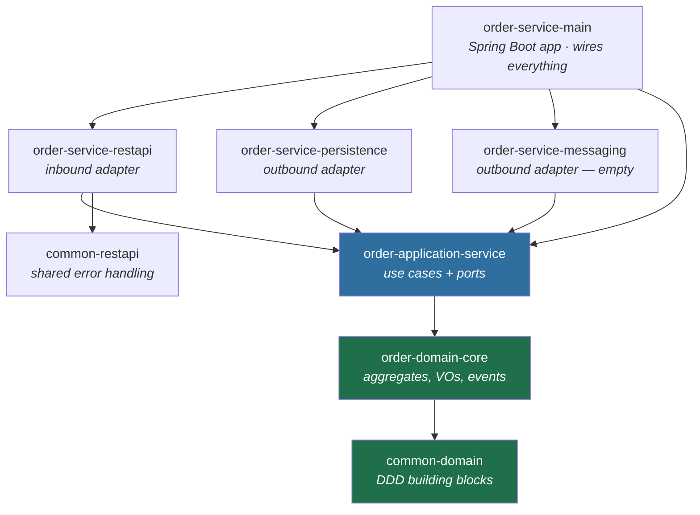

# Architecture Overview

## The problem hexagonal architecture solves

A conventional Spring layered app puts `@Entity` classes at the centre and lets every layer
touch them. The business rules end up spread across controllers, services and JPA entities,
and they can only be exercised by booting Spring and a database.

**Hexagonal architecture (ports & adapters)** inverts that. The business rules sit in a
plain-Java core with no framework imports. Everything the core needs from the outside world
is declared as an *interface it owns* (a **port**). The infrastructure — HTTP, JPA, Kafka —
lives in **adapters** that depend on the core, never the other way round.

DDD supplies the vocabulary for what goes in that core: **aggregates**, **entities**,
**value objects**, **domain events**, **domain services**, **repositories**.

## The dependency rule

This is the one rule the whole layout exists to enforce:

> **Source code dependencies point inwards only.**
> `restapi` → `application-service` → `domain-core` → `common-domain`.
> Nothing in `domain-core` or `application-service` may import from `restapi`, `persistence`
> or `messaging`.

The rule is enforced *mechanically* by the Maven module graph: `order-domain-core`'s only
dependency is `common-domain` (`order-domain-core/pom.xml`), so an import of a JPA entity
would not compile. This is the main reason the project is split into so many small modules —
the compiler, not a code review, is what keeps the core clean.

Read the arrows as "depends on". Note that `app` and the two green modules have **no arrow
pointing out to an adapter** — that is the dependency rule made visible.

## The three rings

### 1. Domain core — `order-domain-core` + `common-domain`

Pure Java. No Spring, no JPA, no Jackson. Contains:

- **Aggregate roots** that protect their own invariants — `Order`, `Customer`, `Business`.
- **Entities** with identity but no independent lifecycle — `OrderItem`, `Product`.
- **Value objects** as Java `record`s — `Money`, `OrderId`, `StreetAddress`, `OrderStatus`.
- **Domain events** — `OrderCreatedEvent`, `OrderPaidEvent`, `OrderCancelledEvent`.
- **Domain exceptions** — `OrderDomainException extends DomainException`.
- A **domain service** for logic that spans more than one aggregate — `OrderDomainService`
  (currently an empty interface; see [next steps](../guides/current-state-and-next-steps.md)).

The `common-domain` module holds the framework-agnostic DDD *building blocks* — `BaseEntity`,
`AggregateRoot`, `DomainEvent`, `DomainException` and the shared value objects — so that a
future `payment-service` or `restaurant-service` can reuse them.

### 2. Application core — `order-application-service`

Orchestration, not business rules. Contains:

- **Use cases** — `CreateOrderUseCase`. One class per business transaction. It loads
  aggregates through output ports, calls domain methods, persists, and publishes events.
- **Output ports** — `OrderRepository`, `CustomerRepository`, `BusinessRepository`. Interfaces
  the core *owns*, phrased in domain terms (`Optional<Business> findBusiness(...)`), that the
  persistence adapter implements.
- **Input ports** — `ExplicitPort`, an example of the "declare an interface for the driving
  side" style. This project mostly uses the concrete use-case class directly instead; see
  [ADR 0002](../decisions/0002-use-case-classes-over-input-port-interfaces.md).
- **Command / result DTOs** — `CreateOrderCommand`, `CreateOrderResult`, `CommandOrderItem`,
  `CommandOrderAddress`. The core's own input and output shapes, independent of HTTP.

This module *is* allowed a thin Spring dependency (`spring-context`, for `@Component`) and
MapStruct. It is not allowed to know about HTTP or SQL.

### 3. Adapters — `restapi`, `persistence`, `messaging`

- **`order-service-restapi`** is a *driving* (inbound) adapter: HTTP comes in, it translates
  a `OrderCreateRequest` into a `CreateOrderCommand`, calls the use case, and translates the
  `CreateOrderResult` back into an `OrderCreateResponse`.
- **`order-service-persistence`** is a *driven* (outbound) adapter: it implements the output
  ports using Spring Data JPA and maps between JPA `@Entity` classes and domain aggregates.
- **`order-service-messaging`** is a placeholder for the event adapter (Kafka). It currently
  contains only a `pom.xml`.

### The composition root — `order-service-main`

The only module that depends on *everything*. It holds `OrderServiceApplication`
(`@SpringBootApplication`) and the real `application.yaml`. Its job is wiring: Spring's
component scan finds `@RestController`, `@Component` and `@Repository` beans across the other
modules and connects port interfaces to adapter implementations by type.

Because all four adapter modules are dependencies of `order-service-main` and nothing else
depends on *it*, swapping an adapter means changing exactly one `pom.xml` entry.

## Why three sets of DTOs?

A newcomer's first reaction is "this is the same data three times". It is deliberate — each
shape belongs to a different ring and changes for a different reason:

| Shape | Module | Owned by | Changes when |
| --- | --- | --- | --- |
| `OrderCreateRequest` | restapi | the HTTP contract | the public API changes |
| `CreateOrderCommand` | application-service | the use case | the business operation changes |
| `Order` (aggregate) | domain-core | the domain | the business rules change |
| `OrderEntity` | persistence | the database schema | the schema changes |

If the core accepted `OrderCreateRequest` directly, a Jackson annotation or a renamed JSON
field would ripple into the business rules. The mappers (`OrderWebMapper`,
`OrderPersistenceMapper`) are the translation seams that stop that. See
[ports-and-adapters.md](ports-and-adapters.md).

## Technology baseline

| Thing | Version / choice | Where it is set |
| --- | --- | --- |
| Java | 25 (`release` 25) | root `pom.xml` `<java.version>` |
| Spring Boot | 4.1.1 (parent POM) | root `pom.xml` `<parent>` |
| Build | Maven multi-module, `packaging: pom` aggregators | every `pom.xml` |
| Mapping | MapStruct 1.6.3 (compile-time, generated impls) | root `pom.xml` `<mapstruct.version>` |
| Boilerplate | Lombok (`optional`, inherited by all modules) | root `pom.xml` `<dependencies>` |
| Persistence | Spring Data JPA + Hibernate, PostgreSQL driver | `order-service-persistence`, `order-service-main` |
| Web | `spring-boot-starter-webmvc` (Boot 4 name) | `order-service-main`, `common-restapi` |
| Validation | `spring-boot-starter-validation` (Jakarta Bean Validation) | `common-restapi`, `restapi`, `application-service` |

Lombok and MapStruct are both annotation processors, and their order matters — the root POM
configures `annotationProcessorPaths` explicitly with `lombok-mapstruct-binding` between them.
See [ADR 0004](../decisions/0004-mapstruct-for-cross-boundary-mapping.md).

## Where to go next

- [modules.md](modules.md) — what is in each module, file by file.
- [domain-model.md](domain-model.md) — the `Order` aggregate and its invariants.
- [create-order-flow.md](create-order-flow.md) — one request traced end to end.
