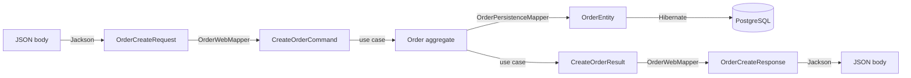

# Ports and Adapters

A **port** is an interface *owned by the core*. An **adapter** is an implementation of it that
lives outside. The direction of ownership is the whole trick: the core declares what it needs,
infrastructure conforms.

Ports come in two flavours, named for who drives whom:

| | Driving / inbound (primary) | Driven / outbound (secondary) |
| --- | --- | --- |
| Who calls whom | outside world → core | core → outside world |
| Example here | `CreateOrderUseCase` (+ `ExplicitPort`) | `OrderRepository`, `CustomerRepository`, `BusinessRepository` |
| Adapter | `OrderCommandController` | `OrderRepositoryAdapter`, `CustomerRepositoryAdapter`, `BusinessRepositoryAdapter` |
| Interface lives in | `order-application-service` | `order-application-service` |
| Implementation lives in | `order-application-service` | `order-service-persistence` |

## Outbound ports

```java
// port/output/OrderRepository.java
public interface OrderRepository {
    Order saveOrder(Order order);
}

// port/output/CustomerRepository.java
public interface CustomerRepository {
    Optional<Customer> findCustomer(UUID customerID);
}

// port/output/BusinessRepository.java
public interface BusinessRepository {
    Optional<Business> findBusiness(UUID businessId, List<UUID> productIds);
}
```

Three things to notice:

1. **They return domain types.** `Optional<Customer>`, not `Optional<CustomerEntity>`. The core
   never sees a JPA class.
2. **They are phrased for the use case, not the table.** `findBusiness(businessId, productIds)`
   exists because `CreateOrderUseCase` needs exactly "the business plus the products this order
   mentions" — not because a `businesses` table happens to look like that. A generic
   `findAll()`-style CRUD interface would push the filtering decision out of the core.
3. **`Optional`, not `null`.** Absence is part of the contract.

## The persistence adapter

```mermaid
flowchart LR
    UC[CreateOrderUseCase] -->|calls| PORT[["BusinessRepository<br/>(interface, core)"]]
    PORT -.->|Spring injects| AD[BusinessRepositoryAdapter<br/>@Repository]
    AD --> JPA[BusinessJpaRepository<br/>extends JpaRepository]
    AD --> MAP[OrderPersistenceMapper]
    JPA --> DB[(businesses table)]
    MAP -->|BusinessEntity → Business| AD
```

The adapter is the sandwich filling: Spring Data does the SQL, MapStruct does the translation,
and the adapter satisfies the port.

```java
@Repository
@RequiredArgsConstructor
public class BusinessRepositoryAdapter implements BusinessRepository {

    private final BusinessJpaRepository businessJpaRepository;
    private final OrderPersistenceMapper orderPersistenceMapper;

    @Override
    public Optional<Business> findBusiness(UUID businessId, List<UUID> productIds) {
        List<BusinessEntity> businessEntities =
                businessJpaRepository.findByBusinessIdAndProductIdIn(businessId, productIds);

        if (businessEntities.isEmpty()) {
            return Optional.empty();
        }
        return Optional.of(orderPersistenceMapper.businessEntitiesToBusiness(businessEntities));
    }
}
```

`BusinessJpaRepository` derives that query from its own method name — `findBy` + `BusinessId`
+ `And` + `ProductId` + `In`. No SQL is written by hand.

The `businesses` table is denormalised: one row per (business, product) pair, so the business's
`active` flag repeats on every row. Folding many rows into one aggregate is the adapter's job,
done in a MapStruct `default` method:

```java
// The businesses table has one row per product, so every row carries the same business id and active flag
default Business businessEntitiesToBusiness(List<BusinessEntity> businessEntities) {
    BusinessEntity businessEntity = businessEntities.getFirst();
    return Business.builder()
            .id(new BusinessId(businessEntity.getBusinessId()))
            .active(Boolean.TRUE.equals(businessEntity.getBusinessActive()))
            .products(businessEntities.stream().map(this::businessEntityToProduct).toList())
            .build();
}
```

That shape mismatch — rows on one side, an aggregate on the other — is precisely the work the
adapter exists to absorb. If the core spoke JPA directly, this reshaping would leak into the
use case.

### Composite keys

`BusinessEntity` has no single-column primary key, so it uses the JPA `@IdClass` form:

```java
@IdClass(BusinessIdEntity.class)
@Entity @Table(name = "businesses")
public class BusinessEntity {
    @Id private UUID businessId;
    @Id private UUID productId;
    private Boolean businessActive;
    private String productName;
    private BigDecimal productPrice;
}
```

`BusinessIdEntity` mirrors those two fields, is `Serializable`, and has `equals`/`hashCode`
(here via Lombok `@EqualsAndHashCode`) — JPA requires all three. Hence
`JpaRepository<BusinessEntity, BusinessIdEntity>`.

### `OrderRepositoryAdapter` is a stub

```java
@Override
public Order saveOrder(Order order) {
    return null;   // ← not implemented
}
```

It has `OrderJpaRepository` injected but does nothing with it. Writing it requires
`Order ⇄ OrderEntity` mapping in both directions, which does not exist yet. See
[current-state-and-next-steps.md](../guides/current-state-and-next-steps.md).

## The inbound adapter

```java
@RestController
@RequestMapping("/api/v1/orders")
@RequiredArgsConstructor
public class OrderCommandController {

    private final CreateOrderUseCase createOrderUseCase;
    private final OrderWebMapper orderWebMapper;

    @ResponseStatus(HttpStatus.CREATED)
    @PostMapping
    public OrderCreateResponse createOrder(@Valid @RequestBody OrderCreateRequest orderCreateRequest) {
        CreateOrderCommand createOrderCommand =
                orderWebMapper.orderCreateRequestToCreateOrderCommand(orderCreateRequest);
        CreateOrderResult createOrderResult = createOrderUseCase.execute(createOrderCommand);
        return orderWebMapper.createOrderResultToOrderCreateResponse(createOrderResult);
    }
}
```

Four lines of body, and every one is translation or delegation. A controller in this
architecture has **no** business logic, **no** `if`, **no** repository access. If you find
yourself wanting any of those, the logic belongs in the use case or the aggregate.

Validation (`@Valid`) happens here, at the edge, before the command is built — so the core can
assume structurally well-formed input and concern itself only with *business* rules.

## Mapping between the rings

Each boundary crossing has its own mapper, generated at compile time by MapStruct:



### How MapStruct is set up

```java
@Mapper(componentModel = "spring")
public interface OrderWebMapper {
    CreateOrderCommand orderCreateRequestToCreateOrderCommand(OrderCreateRequest orderCreateRequest);
    OrderCreateResponse createOrderResultToOrderCreateResponse(CreateOrderResult createOrderResult);
}
```

You write the interface; the annotation processor writes `OrderWebMapperImpl` into
`target/generated-sources/annotations/` and annotates it `@Component`, so Spring injects it like
any other bean. `componentModel = "spring"` is what produces that `@Component`.

Nested records are handled automatically — MapStruct sees `List<OrderItemRequest>` on one side
and `List<CommandOrderItem>` on the other and generates the element mapper itself.

When names or shapes differ, you say so with `@Mapping`, as `OrderPersistenceMapper` does to
reach *into* a value object:

```java
@Mapping(source = "id",           target = "id.value")        // UUID → CustomerId(UUID value)
Customer customerEntityToCustomer(CustomerEntity customerEntity);

@Mapping(source = "productId",    target = "id.value")
@Mapping(source = "productName",  target = "name")
@Mapping(source = "productPrice", target = "price.amount")    // BigDecimal → Money(BigDecimal amount)
Product businessEntityToProduct(BusinessEntity businessEntity);
```

`target = "id.value"` tells MapStruct to construct the `CustomerId` record around the raw
`UUID`. This is how the flat, primitive-typed persistence model is lifted back into typed
value objects.

> ⚠️ **Silent unmapped fields.** MapStruct matches by name, case-sensitively, and its default
> `unmappedTargetPolicy` is `WARN` — so a mismatch compiles fine and yields `null` at runtime.
> `OrderWebMapper` has two live instances of this: `OrderCreateRequest.orderAddress` does not
> match `CreateOrderCommand.deliveryAddress`, and `OrderItemRequest.subTotal` does not match
> `CommandOrderItem.subtotal`. You can read the damage in the generated
> `OrderWebMapperImpl`, where both are hardcoded `null`. Fix and hardening advice in
> [current-state-and-next-steps.md](../guides/current-state-and-next-steps.md).

## Error handling across the boundary

`common-restapi` owns the wire format:

```java
@RestControllerAdvice
public class GlobalExceptionHandler {
    @ResponseStatus(HttpStatus.BAD_REQUEST)
    @ExceptionHandler(MethodArgumentNotValidException.class)
    public RestApiErrorResponse<?> handleException(MethodArgumentNotValidException e) { ... }
}
```

It lives in `mptc.khay.restapi.exception`, outside the `mptc.khay.order` component-scan root, so
`order-service-restapi` subclasses it inside a scanned package:

```java
@RestControllerAdvice
public class OrderGlobalExceptionHandler extends GlobalExceptionHandler {
    // TODO: write the exception
}
```

That subclass is where order-specific handlers belong — `OrderDomainException` → 400,
"customer not found" → 404, and so on. It is currently empty, so an
`OrderDomainException` reaching the controller becomes a bare HTTP 500.

## How the wiring actually happens

There is no XML and no manual `new`. At startup:

1. `@SpringBootApplication` on `mptc.khay.order.OrderServiceApplication` scans `mptc.khay.order.**`.
2. It finds `@RestController OrderCommandController`, `@Component CreateOrderUseCase`,
   `@Repository *RepositoryAdapter`, and the generated `@Component *MapperImpl`.
3. `@EnableJpaRepositories` creates proxies for the `*JpaRepository` interfaces.
4. Constructor injection (via Lombok `@RequiredArgsConstructor` on `final` fields) matches each
   dependency **by type** — so `BusinessRepository` in the use case resolves to
   `BusinessRepositoryAdapter`, the only bean implementing it.

Step 4 is the payoff. Swapping PostgreSQL for MongoDB means writing a new `@Repository` that
implements the same three interfaces and changing one dependency in
`order-service-main/pom.xml`. Not one line of `order-domain-core` or
`order-application-service` changes.
